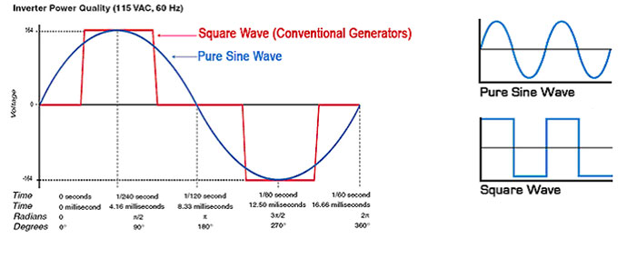

# Basic Audio File
## WAV and PCM

WAV file is an audio file which standards for "Waveform Audio File".

PCM file is always contained within the WAV file as inner layer that standards for "Pulse Code Modulation", which is a standard way to digitally represent audio signals.

## Abstraction of Audio

Audio is a sound wave signal represented mathematically in COS/SIN functions.

Example: audio wave sine.
<pre style="background:#0977f4;">
<code style="color:#fff;font:18px Georgia serif;letter-spacing:0.33rem;">
    f(x) = a.sin(b(x+c)) + d

    period = 2&pi; / f requency
</code>
</pre>

# Audio File
Like any file audio file consist of header (signature) which defines the type of file so that associated Apps can read it or edit it if allowed.

# Audio Quality (Bit Rate)

Consider the following values when authorin audio files:

|Bit Rate |Bit Size(bit) |Channel|Sample Rate|File Size(Uncompressed) |Consumed |Duration hours/1GB Audio |
|---------|--------------|-------|-----------|------------------------|---------|-------------------      |
|24kbps	  |16            |Stereo |44.1KHz	   |630MB	                  |10.8MB/hr|92                   |
|56kbps	  |16            |Stereo |44.1KHz	   |630MB	                  |25.2MB/hr|39                   |
|56kbps	  |24            |Stereo |44.1KHz	   |948MB	                  |25.2MB/hr|39                   |
|96kbps	  |16            |Stereo |44.1KHz	   |630MB	                  |43.2MB/hr|23                   |
|128kbps  |24            |Stereo |44.1KHz	   |948MB	                  |57.6MB/hr|17                   |
|128kbps  |16            |Stereo |44.1KHz	   |691MB	                  |57.6MB/hr|17                   |
|128kbps  |16            |Mono	 |48.0KHz	   |342MB	                  |57.6MB/hr|17                   |
|128kbps  |16            |Stereo |22.0KHz	   |316MB	                  |57.6MB/hr|17                   |
|196kbps  |16            |Stereo |44.1KHz	   |630MB	                  |88.2MB/hr|11                   |
|196kbps  |16            |Mono	 |44.1KHz	   |342MB	                  |88.2MB/hr|11                   |
